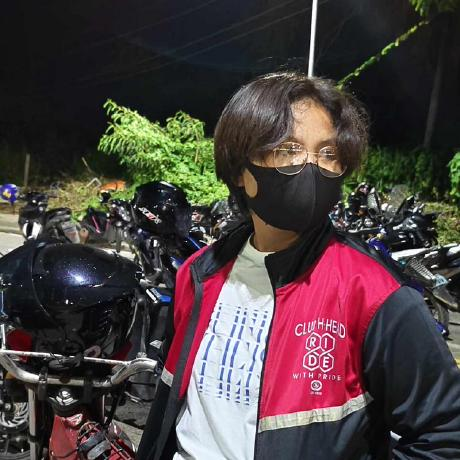

# CozyCup Coffee House Website

## Project Description
The **CozyCup Coffee House** website is a simple website that offers different coffee drinks and pastries. This website was made using HTML and CSS.

## Features
- Navigations to Home, Menu, About the cafe's history and the team, and Contact.
- View the price of the drinks and pastries.
- A contact page for the cafe's address, phone number, email, contact form, and the map.

## Screen Captures
 

This is the **Home Page**.

 

This is the **Coffee Menu** page.

 

This is the **Best Sellers** page.

 

This is the **Contact** page.

## The Authors

 

### John Victor Dato-on 
Website and Repository Owner

### Links

Email: **victordatoon@gmail.com**

 

### Marie Cristel Bugayong
Collaborator

### Links

Email: **cristelbugayong@email.com**